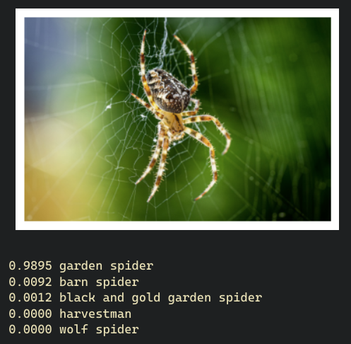
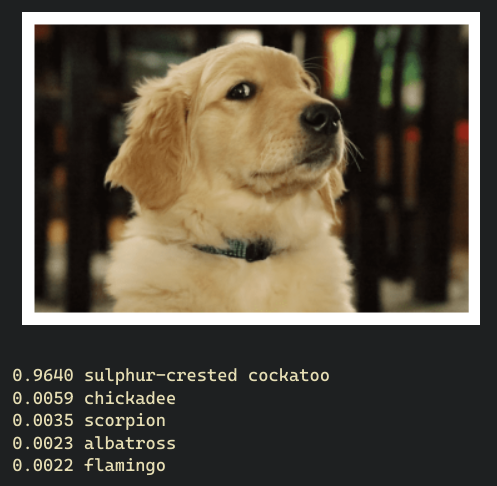
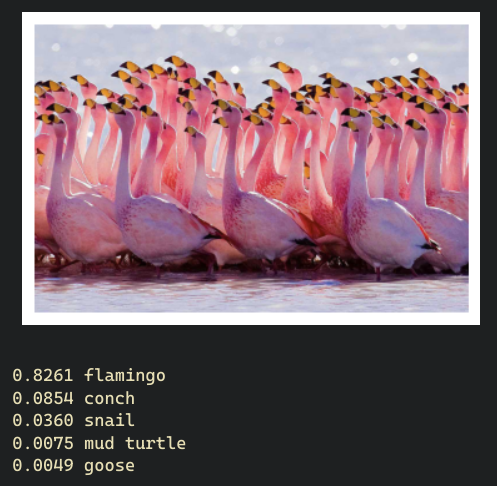

# YOLO

## Paper notes
* Object detection methods (yolo and prior)
    * Sliding window, classify every windows.
    * Region proposals, classify the proposed (most likely to contain objects) regions.
    * YOLO, end to end approach.

##  YOLO predictions
* The prediction from one image is a single tensor.
* Divide the input image to S x S grid.
* The grid where the center of the ground truth bbox belongs, will be responsible to predict the bounding box.
* Each grid cells predicts B bboxes (x, y, w, h) plus the confidence, also the C classes probs.
* Summary, for a single image, the prediction will be S x S x (B * 5 + C)

# Usage
Download 2 datasets required for this experiment.
```bash
./scripts/download_imagenet_100.bash
./scripts/download_pascal_voc_2012.bash
```
Sanity checks.
```bash
python src/yolo/imagenet100.py
python src/yolo/pascalvoc.py
python src/yolo/utils.py
python src/yolo/yolo_model.py
python src/yolo/yolo_loss.py
python src/yolo/yolo_scheduler.py
```
Modify `pretrain_config.py` and train backbone on ImageNet100.
```bash
accelerate launch src/yolo/pretrain_train.py
```
Extract just the backbone from pretrained model (essentially removing the classification layer).
```bash
python src/yolo/extract_backbone.py <pretrained_path> <output_backbone_path>

# example (using default value for output backbone path)
python src/yolo/extract_backbone.py src/yolo/accelerate_logs/exp_2023-07-25_17-55-26/checkpoints/checkpoint_33/pytorch_model.bin
```
Modify `detection_config.py` and train object detector on Pascal VOC.
```bash
accelerate launch src/yolo/detection_train.py
```

# Results
## Pretraining
This classifier is pretrained on ImageNet100 (not 1000 because of resources limitations), and the dog is not one of the classes. See on [wandb](https://wandb.ai/evanarlian/yolo_pretraining) for full metrics.
<div style="display: flex; flex-wrap: wrap;">
    
    
    
</div>

## Detection
TODO

# TODO
* check if huggingface datasets can speed up image data (just like audio mmap)
* find bottleneck in training

# TODO now
* best course of action:
    * freeze for 1 epoch, check result (DOING)
    * train on fully untrained model
    * revert the eye code and prevent inf/nan with clamp or whatever
    * see others impl
* infinity problem is not solved by using 1 boolean force, 
* boolean forcing may create a dumb network, since latter B is not trained
* wandb log image
* check on model reshaping (i initially only use 30 <=> 20 on linear layer), maybe check on official wongkinyiu + ultralytics
* try torchmetric's mAP first, torchmetrics map on a batch??


# Questions
* How to supply S (yolo image grid) to model construction? 7 is obtained by the result of previous layers, so not from S.

# References
* [YOLO paper](https://arxiv.org/abs/1506.02640)
* [YOLO from scratch](https://www.youtube.com/watch?v=n9_XyCGr-MI)
* [Accelerate + WandB blog](https://wandb.ai/gladiator/HF%20Accelerate%20+%20W&B/reports/Hugging-Face-Accelerate-Super-Charged-with-Weights-Biases--VmlldzoyNzk3MDUx?utm_source=docs&utm_medium=docs&utm_campaign=accelerate-docs)


