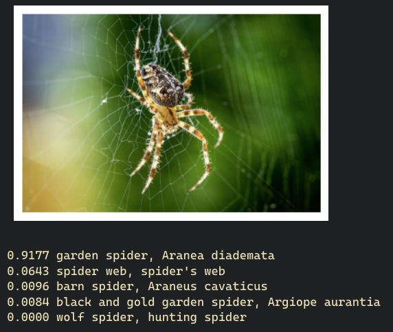
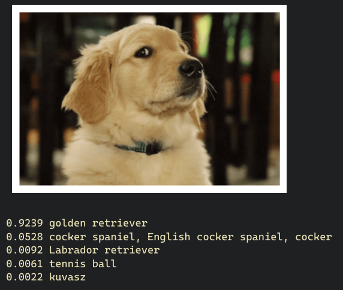
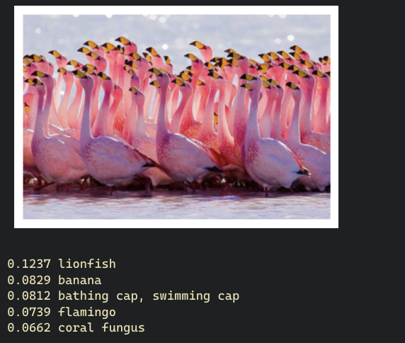
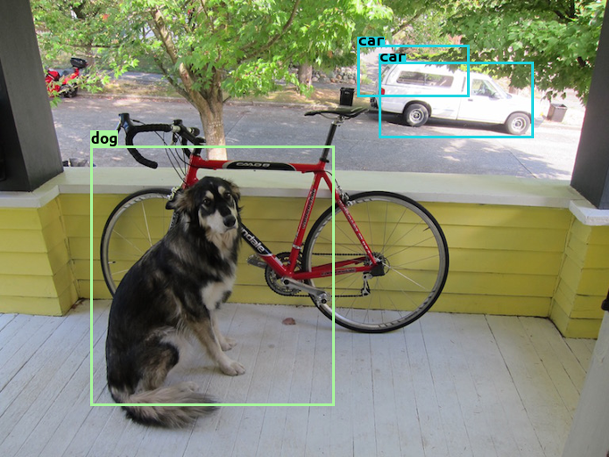
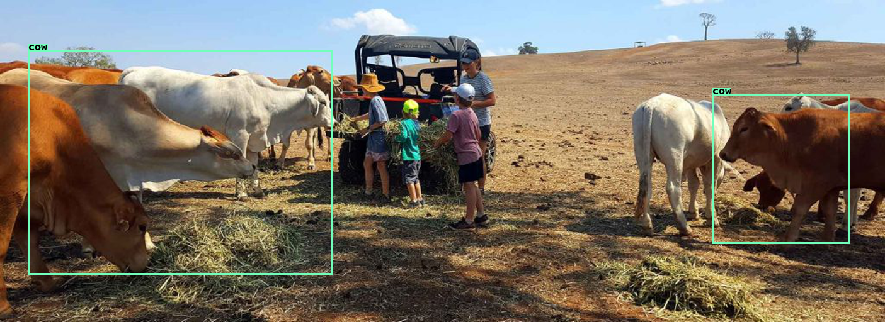
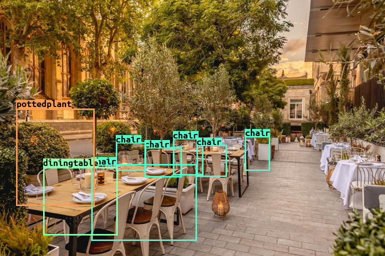
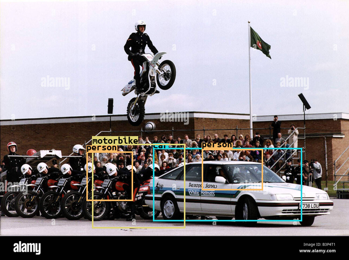
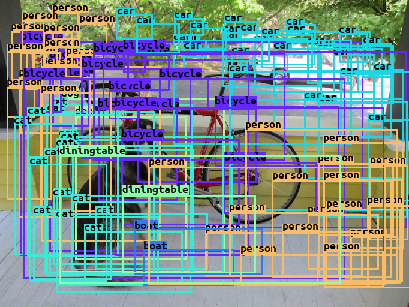

# YOLO

## Paper notes
* Object detection methods (yolo and prior)
    * Sliding window, classify every windows.
    * Region proposals, classify the proposed (most likely to contain objects) regions.
    * YOLO, end to end approach.

##  YOLO predictions
* The prediction from one image is a single tensor.
* Divide the input image to S x S grid.
* The grid where the center of the ground truth bbox belongs, will be responsible to predict the bounding box.
* Each grid cells predicts B bboxes (x, y, w, h) plus the confidence, also the C classes probs.
* Summary, for a single image, the prediction will be S x S x (B * 5 + C)

# Usage
Download 2 datasets required for this experiment.
```bash
./scripts/download_imagenet_100.bash
./scripts/download_pascal_voc_2012.bash
```
Sanity checks.
```bash
python src/yolo/imagenet100.py
python src/yolo/pascalvoc.py
python src/yolo/utils.py
python src/yolo/yolo_model.py
python src/yolo/yolo_loss.py
python src/yolo/yolo_scheduler.py
```
Modify `pretrain_config.py` and train backbone on ImageNet100.
```bash
accelerate launch src/yolo/pretrain_train.py
```
Extract just the backbone from pretrained model (essentially removing the classification layer).
```bash
python src/yolo/extract_backbone.py <pretrained_path> <output_backbone_path>

# example (using default value for output backbone path)
python src/yolo/extract_backbone.py src/yolo/accelerate_logs/exp_2023-08-02_17-49-37/checkpoints/checkpoint_27/pytorch_model.bin
```
Modify `detection_config.py` and train object detector on Pascal VOC.
```bash
accelerate launch src/yolo/detection_train.py
```

# Results
## Pretraining
The model is trained on ImageNet only for 42 epochs. On validation, the model performed 67% and 87% on top1 and top5 acc, repectively. See on [wandb](https://wandb.ai/evanarlian/yolo_pretraining) for full metrics.
<div style="display: flex; flex-wrap: wrap;">
    
    
    
</div>

## Detection
The model is using above pretrained backbone, and further finetuned on Pascal VOC for 135 epochs. On validation, the model performed at about 0.39 mAP@50. See on [wandb](https://wandb.ai/evanarlian/yolo_detection) for full metrics.





## Extras
Just for fun, this is what happened if we turned the confidence threshold to 0.0 and nms threshold to 1.0. We can see every bbox predicted with yolo before any postprocessing.
$$S * S * B = 7 * 7 * 2 = 98$$


# Implementation details
* 7 is obtained by the result of previous layers, so not from `S`. How to supply S (yolo image grid) to model construction? Currently the YoloDetection class only accepts `B` and `C`.
* Detection head uses sigmoid (the paper uses identity/linear activation). After a lot of trial, without sigmoid the gradient will explode.
* The learning rate used is much lower than the paper, about 7 times lower, or otherwise the gradient will explode too.

# References
* [YOLO paper](https://arxiv.org/abs/1506.02640)
* [YOLO from scratch](https://www.youtube.com/watch?v=n9_XyCGr-MI)
* [Accelerate + WandB blog](https://wandb.ai/gladiator/HF%20Accelerate%20+%20W&B/reports/Hugging-Face-Accelerate-Super-Charged-with-Weights-Biases--VmlldzoyNzk3MDUx?utm_source=docs&utm_medium=docs&utm_campaign=accelerate-docs)


